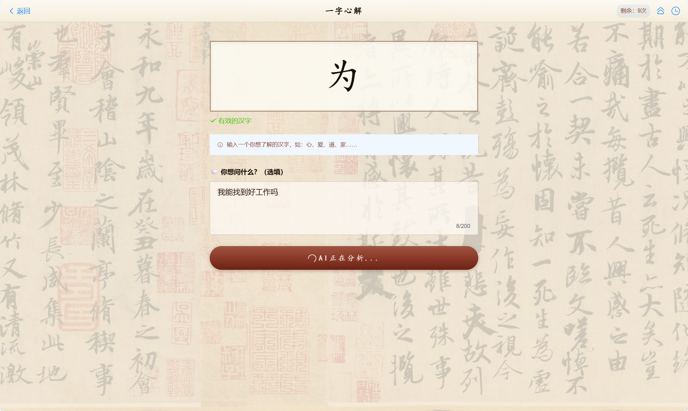

<p align="center">
  
</p>

<h1 align="center">一字心解</h1>
<p align="center">
  <strong>Yi Zi Xin Jie — One Character, One Heart</strong>
</p>

<p align="center">
  
  
  
  
</p>

<p align="center">
  <a href="https://yizixinjie.pages.dev"><strong>🌐 在线体验</strong></a> ·
  <a href="#-项目简介"><strong>📖 项目简介</strong></a> ·
  <a href="#-功能特性"><strong>✨ 功能特性</strong></a> ·
  <a href="#-技术架构"><strong>🏗 技术架构</strong></a> ·
  <a href="#-快速开始"><strong>🚀 快速开始</strong></a>
</p>

---

## 📖 项目简介

**一字心解**是一款融合 AI 技术与中国古代测字术的 Web 应用。用户手写一个汉字，AI 将从**字源学**、**文化学**、**字相学**三个维度进行深度解析，并结合《测字秘牒》《心易六法》等古籍智慧，给出「测字取格」与个性化建议。

> 盖一字之来必各有体，因其体之隐现不同，故其测之变化不定。——《测字秘牒》

### 🎯 核心理念

汉字是中华文明的基因密码。每一个汉字都承载着数千年的文化记忆、先民智慧和心理投射。一字心解通过现代 AI 技术，让古老的**测字术**焕发新生，帮助用户通过一个汉字洞察自我、寻找方向。

---

## ✨ 功能特性

### 🔮 智能测字
- **AI 深度解析**：基于 DeepSeek 大模型，从字源、文化、字相三个维度生成超 2000 字的专业分析
- **测字取格**：融入《测字秘牒》的装头、接脚、穿心、破解、对关五法，一语定乾坤
- **五行六神**：每个汉字自动判断五行归属与六神临位，给出吉凶趋势

### 💬 个性化提问
- 用户可自定义人生困惑（如"我什么时候能找到好工作"）
- AI 将汉字意象与用户问题结合，生成高度个性化的解读和建议
- 每次分析输出 3-5 条具体可操作的建议

### 🎨 古风美学
- 以王羲之《兰亭序》为底纹，宣纸质感卡片
- 朱砂红印章按钮、墨色文字、绢丝边框
- 自适应移动端与桌面端

### 📊 使用管理
- 每日免费 2 次，密钥解锁 10 次/天
- 密钥基于 SHA-256 动态生成，每日自动轮换
- 访问统计实时展示

### 📱 PWA 支持
- 可添加到手机主屏幕
- 离线基础可用

---

## 🎬 页面预览

| 首页 | 测字输入 | 结果分析 |
|:---:|:---:|:---:|
|  |  |  |

<p align="center">
  
</p>

---

## 🏗 技术架构

```
┌──────────────────────────────────────────────────────┐
│                   用户浏览器                           │
│            https://yizixinjie.pages.dev               │
└────────────┬──────────────────────────┬──────────────┘
             │  Cloudflare Pages       │  HTTPS
             │  前端 SPA (Vue 3)        │  POST /analyze
             ▼                          ▼
┌────────────────────┐   ┌──────────────────────────────┐
│   Cloudflare CDN    │   │      腾讯云 SCF (广州)         │
│   Vue 3 + Vite      │   │   Node.js 18  Serverless     │
│   Vant UI 组件库     │   │                              │
│   古风 CSS 主题      │   │   ├─ /analyze → DeepSeek API │
│   兰亭序底纹动画     │   │   ├─ /key     → 密钥验证      │
│                     │   │   ├─ /stats   → 访问统计      │
│                     │   │   └─ /ping    → 访问心跳      │
└────────────────────┘   └──────────────┬───────────────┘
                                        │ HTTPS
                                        ▼
                           ┌──────────────────────────────┐
                           │       DeepSeek API            │
                           │   deepseek-chat 模型          │
                           │   测字心法 Prompt 工程         │
                           └──────────────────────────────┘
```

### 技术栈

| 层级 | 技术 | 说明 |
|------|------|------|
| 🖥 前端框架 | Vue 3 + Vite | SPA 单页应用，按需加载 |
| 🎨 UI 组件 | Vant 4 | 移动端优先组件库 |
| 📦 状态管理 | Pinia | 轻量级状态管理 |
| 🗺 路由 | Vue Router 4 | History 模式路由 |
| 🌐 前端部署 | Cloudflare Pages | 全球 CDN，国内可访问 |
| ⚡ 后端计算 | 腾讯云 SCF | Serverless 函数，按量付费 |
| 🤖 AI 引擎 | DeepSeek API | 文本大模型 |
| 📊 统计存储 | jsonblob.com | 免费 JSON 云存储 |
| 🔐 密钥系统 | SHA-256 哈希 | 每日自动轮换 |

### 项目结构

```
yizixinjie/
├── frontend/                    # Vue 3 前端
│   ├── src/
│   │   ├── pages/               # 页面组件
│   │   │   ├── Home.vue         # 首页
│   │   │   ├── Camera.vue       # 测字输入页
│   │   │   ├── Result.vue       # 结果展示页
│   │   │   ├── History.vue      # 历史记录页
│   │   │   └── About.vue        # 关于页
│   │   ├── components/          # 可复用组件
│   │   ├── stores/              # Pinia 状态管理
│   │   ├── services/            # API 调用层
│   │   ├── utils/               # 工具函数
│   │   └── styles/              # 古风主题 CSS
│   ├── public/                  # 静态资源
│   │   ├── bg.jpg               # 兰亭序背景
│   │   └── logo.png             # 网站 Logo
│   └── index.html               # HTML 入口
├── scf/                         # 腾讯云 SCF 函数
│   ├── index.js                 # 函数主入口
│   ├── deploy.js                # 自动部署脚本
│   └── public/                  # 内嵌前端静态文件
├── backend/                     # 本地开发后端（可选）
├── screenshots/                 # 项目截图
├── vercel.json                  # Vercel 部署配置（旧版）
├── render.yaml                  # Render 部署配置（备选）
└── README.md                    # 项目说明
```

---

## 🚀 快速开始

### 前置要求

- Node.js >= 18.x
- 腾讯云账号（用于部署 SCF）
- Cloudflare 账号（用于部署前端）
- DeepSeek API Key（[申请地址](https://platform.deepseek.com)）

### 本地开发

```bash
# 克隆项目
git clone git@github.com:CHN-DST/yizixinjie.git
cd yizixinjie

# 启动本地后端
cd backend
cp .env.example .env.local
# 编辑 .env.local 设置 DEEPSEEK_API_KEY
npm install && npm run dev

# 启动前端开发服务器
cd ../frontend
npm install && npm run dev
```

### 一键部署

```bash
# 构建前端
cd frontend
VITE_API_BASE_URL=https://your-scf-url.ap-guangzhou.tencentscf.com npm run build

# 部署 SCF 函数
cd ../scf
node deploy.js

# 部署前端到 Cloudflare Pages
cd ../frontend
npx wrangler pages deploy dist --project-name=yizixinjie
```

---

## 🔐 密钥系统

| 模式 | 次数/天 | 重置时间 |
|------|---------|----------|
| 🆓 免费 | 2 次 | 每日 24:00 |
| 🔑 密钥 | 10 次 | 每日 24:00 |

密钥基于 `SHA-256(种子 + 日期)` 自动生成，格式 `YZXJ-XXXXXXXX`，每日自动轮换。

---

## 📝 更新日志

### v0.2.0 (2026-06-04)

- 🎨 全面古风化 UI 重设计（兰亭序底纹、宣纸卡片、朱砂印章按钮）
- 🔮 融入《测字秘牒》心法（装头/接脚/穿心/破解/对关/五行六神）
- 📊 云端访问统计（jsonblob 多实例共享）
- 🔑 每日密钥系统（SHA-256 动态生成）
- 🖼 兰亭序背景滚动动画
- 📱 PWA 基础支持
- 🏗 全自动部署（SCF API + Cloudflare wrangler）

### v0.1.0 (2026-06-02)

- 🎉 初始版本发布
- 🔍 DeepSeek AI 测字分析
- ✏️ 直接输入汉字 + 自定义提问
- 📋 历史记录（本地存储）
- 🎨 基础样式与响应式布局

---

## 🤝 贡献

欢迎提交 Issue 和 Pull Request。

---

## 📄 许可证

[MIT License](LICENSE) © 2026 一字心解

---

<p align="center">
  <i>一字见心，一字明道。</i>
</p>
