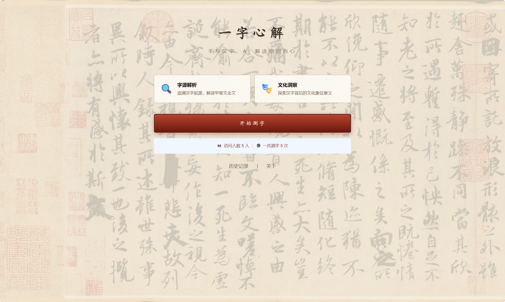
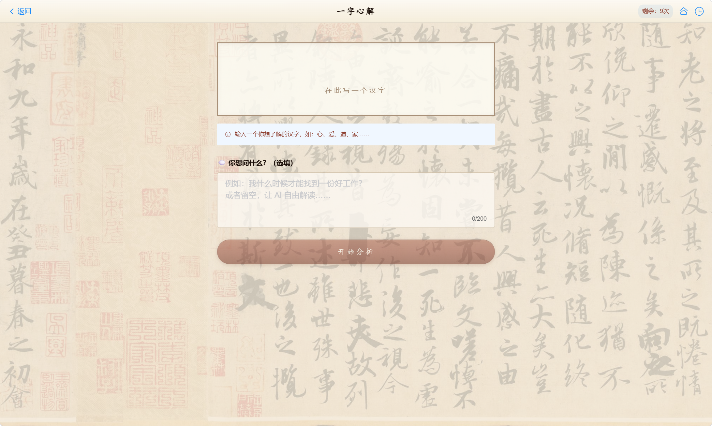
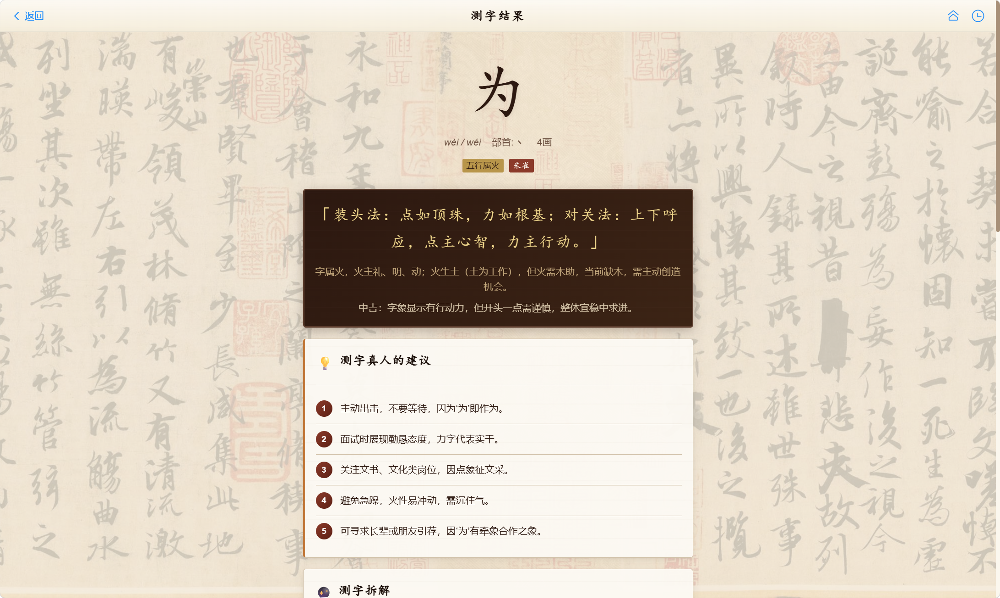
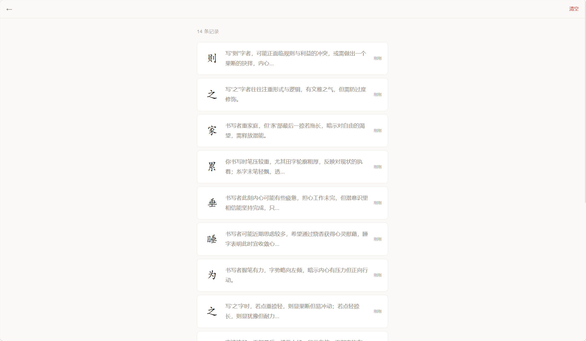
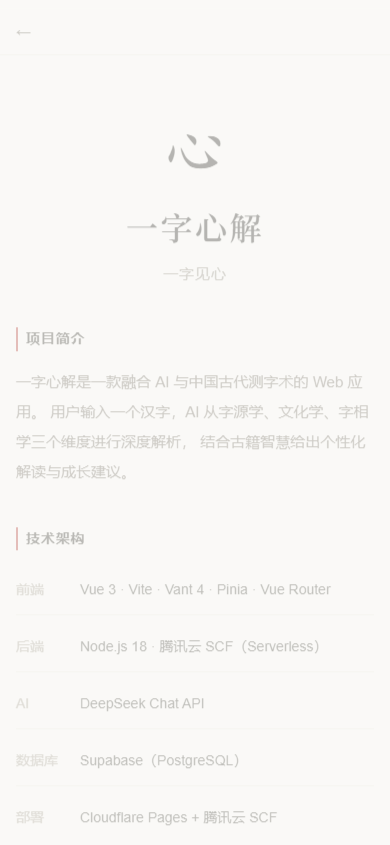

<p align="center">
  
</p>

<h1 align="center">一字心解</h1>
<p align="center">
  <strong>Yi Zi Xin Jie — One Character, One Heart</strong>
</p>

<p align="center">
  
  
  
  
</p>

<p align="center">
  <a href="https://yizixinjie.pages.dev"><strong>🌐 在线体验</strong></a> ·
  <a href="#-项目简介"><strong>📖 项目简介</strong></a> ·
  <a href="#-功能特性"><strong>✨ 功能特性</strong></a> ·
  <a href="#-技术架构"><strong>🏗 技术架构</strong></a> ·
  <a href="#-快速开始"><strong>🚀 快速开始</strong></a>
</p>

---

## 📖 项目简介

**一字心解**是一款融合 AI 与中国古代测字术的 Web 应用。输入一个汉字，AI 从**字源学**、**文化学**、**字相学**三个维度进行深度解析，结合《测字秘牒》《心易六法》等古籍智慧，给出测字取格与个性化成长建议。

> 盖一字之来必各有体，因其体之隐现不同，故其测之变化不定。——《测字秘牒》

### 🎯 核心理念

汉字是中华文明的基因密码。一字心解通过现代 AI 技术，让古老的**测字术**焕发新生，帮助用户通过一个汉字洞察自我、寻找方向。

---

## ✨ 功能特性

### 🔮 智能测字
- **AI 深度解析**：基于 DeepSeek 大模型，从字源、文化、字相三个维度生成专业分析
- **测字取格**：融入《测字秘牒》的装头、接脚、穿心、破解、对关五法
- **五行六神**：每个汉字自动判断五行归属与六神临位

### 💬 个性化提问
- 用户可自定义人生困惑（如"我什么时候能找到好工作"）
- AI 将汉字意象与用户问题结合，生成个性化解读和建议
- 每次分析输出 3-5 条具体可操作的建议

### 🎨 现代东方极简设计
- 宣纸白底色、墨灰文字、鎏金点缀、朱砂强调
- 克制留白、呼吸感排版
- 自适应移动端与桌面端

### 📊 使用管理
- 每日免费 2 次，密钥解锁 10 次/天
- 密钥基于 SHA-256 动态生成，每日自动轮换
- 隐藏密钥支持无限次使用

### 🗄 数据存储
- Supabase PostgreSQL 数据库记录测字历史
- 后台管理系统查看所有记录

### 🔗 分享功能
- 生成精美海报卡片
- 一键保存为 PNG 图片

---

## 🎬 页面预览

| 首页 | 测字输入 | 结果分析 |
|:---:|:---:|
|  |  |

| 结果分析 |
|:---:|
|  |

| 结果分析 |
|:---:|:---:|
|  |

| 历史记录 | 关于页面 |
|:---:|:---:|
|  |  |

---

## 🏗 技术架构

```
┌──────────────────────────────────────────────────────┐
│                   用户浏览器                           │
│            https://yizixinjie.pages.dev               │
└────────────┬──────────────────────────┬──────────────┘
             │  Cloudflare Pages       │  HTTPS
             │  前端 SPA (Vue 3)        │  POST /analyze
             ▼                          ▼
┌────────────────────┐   ┌──────────────────────────────┐
│   Cloudflare CDN    │   │      腾讯云 SCF (广州)         │
│   Vue 3 + Vite      │   │   Node.js 18  Serverless     │
│   Vant 4 UI 组件库   │   │                              │
│   现代东方极简主题    │   │   ├─ /analyze → DeepSeek API │
│                     │   │   ├─ /key     → 密钥验证      │
│                     │   │   └─ /admin   → 后台管理      │
└────────────────────┘   └──────────────┬───────────────┘
                                        │ HTTPS
                                        ▼
                           ┌──────────────────────────────┐
                           │       DeepSeek API            │
                           │   deepseek-chat 模型          │
                           │   测字心法 Prompt 工程         │
                           └──────────────────────────────┘
                                        │
                                        ▼
                           ┌──────────────────────────────┐
                           │    Supabase (PostgreSQL)      │
                           │   测字记录持久化存储           │
                           └──────────────────────────────┘
```

### 技术栈

| 层级 | 技术 | 说明 |
|------|------|------|
| 🖥 前端框架 | Vue 3 + Vite | SPA 单页应用 |
| 🎨 UI 组件 | Vant 4 | 移动端优先组件库 |
| 📦 状态管理 | Pinia | 轻量级状态管理 |
| 🗺 路由 | Vue Router 4 | History 模式路由 |
| 🌐 前端部署 | Cloudflare Pages | 全球 CDN |
| ⚡ 后端计算 | 腾讯云 SCF | Serverless 函数 |
| 🤖 AI 引擎 | DeepSeek API | 文本大模型 |
| 🗄 数据库 | Supabase | PostgreSQL 云数据库 |
| 🔐 密钥系统 | SHA-256 哈希 | 每日自动轮换 |

### 项目结构

```
yizixinjie/
├── frontend/                    # Vue 3 前端
│   ├── src/
│   │   ├── pages/               # 页面组件
│   │   │   ├── Home.vue         # 首页 + 今日解字
│   │   │   ├── Camera.vue       # 测字输入页
│   │   │   ├── Result.vue       # 结果展示页
│   │   │   ├── History.vue      # 历史记录页
│   │   │   ├── About.vue        # 关于页
│   │   │   └── Admin.vue        # 后台管理页
│   │   ├── components/          # 可复用组件
│   │   │   └── common/
│   │   │       ├── Footer.vue
│   │   │       └── SharePoster.vue  # 分享海报
│   │   ├── stores/              # Pinia 状态管理
│   │   ├── services/            # API 调用层
│   │   ├── utils/               # 工具函数
│   │   └── styles/              # 现代东方极简主题
│   ├── public/                  # 静态资源
│   └── index.html               # HTML 入口
├── scf/                         # 腾讯云 SCF 函数
│   ├── index.js                 # 函数主入口
│   ├── deploy.js                # 自动部署脚本
│   └── public/                  # 内嵌前端静态文件
├── screenshots/                 # 项目截图
└── README.md                    # 项目说明
```

---

## 🚀 快速开始

### 前置要求

- Node.js >= 18.x
- 腾讯云账号（用于部署 SCF）
- Cloudflare 账号（用于部署前端）
- DeepSeek API Key（[申请地址](https://platform.deepseek.com)）

### 本地开发

```bash
# 克隆项目
git clone https://github.com/CHN-DST/yizixinjie.git
cd yizixinjie

# 启动前端开发服务器
cd frontend
npm install && npm run dev
```

### 一键部署

```bash
# 构建前端
cd frontend
npm run build

# 部署 SCF 函数（需设置腾讯云凭证）
cd ../scf
export TENCENT_SECRET_ID=your_id
export TENCENT_SECRET_KEY=your_key
node deploy.js

# 部署前端到 Cloudflare Pages
cd ../frontend
export CLOUDFLARE_API_TOKEN=your_token
npx wrangler pages deploy dist --project-name=yizixinjie
```

---

## 📝 更新日志

### v0.3.0 (2026-06-09)

- 🎨 **现代东方极简 UI 重设计**：宣纸白 · 墨灰 · 鎏金 · 朱砂配色系统
- 🏠 首页重设计：极简 Hero + 汉字输入 + 今日解字模块
- 📄 结果页升级：折叠面板、赠言展示、结果展开动画
- 🖼 分享海报：Canvas 绘制精美分享卡片，一键保存 PNG
- 📖 关于页：技术架构、参考古籍、GitHub 开源信息
- 🗄 Supabase 数据库记录测字历史
- 🔧 后台管理系统（`/admin`）
- 🔑 隐藏密钥无限次使用支持
- ⚡ CSS 体积优化 67%，去除全量 Vant CSS

### v0.2.0 (2026-06-04)

- 🎨 古风化 UI 设计（兰亭序底纹、宣纸卡片、朱砂印章按钮）
- 🔮 融入《测字秘牒》心法（装头/接脚/穿心/破解/对关/五行六神）
- 🔑 每日密钥系统（SHA-256 动态生成）
- 🏗 全自动部署（SCF API + Cloudflare wrangler）

### v0.1.0 (2026-06-02)

- 🎉 初始版本发布
- 🔍 DeepSeek AI 测字分析
- ✏️ 直接输入汉字 + 自定义提问
- 📋 历史记录（本地存储）

---

## 📄 许可证

[MIT License](LICENSE) © 2026 一字心解

---

<p align="center">
  <i>一字心解 · 一字见心</i>
</p>
